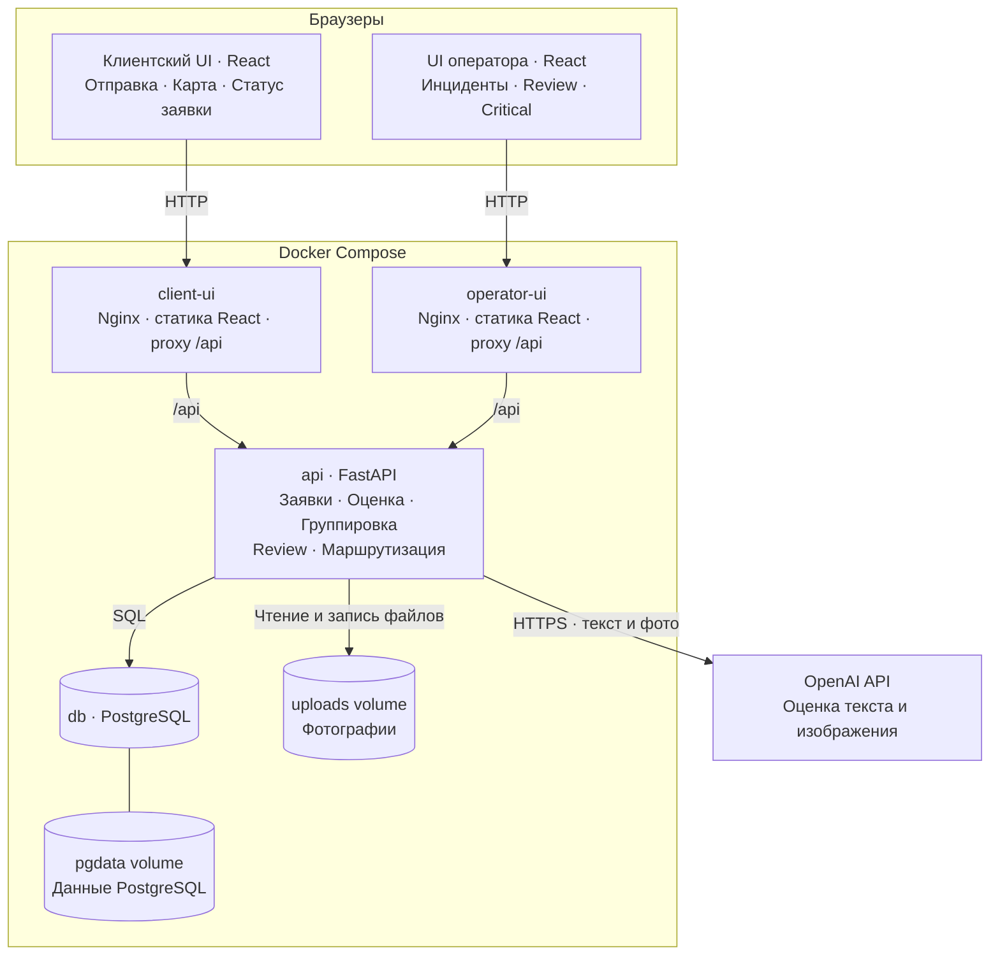
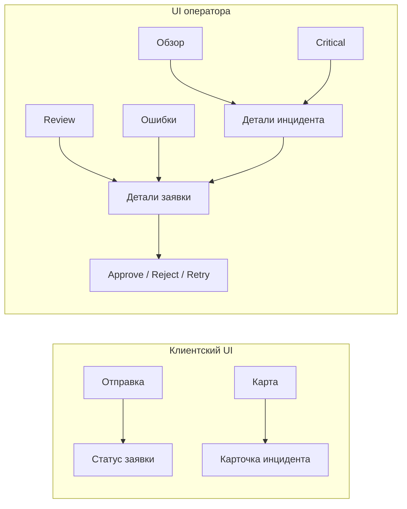
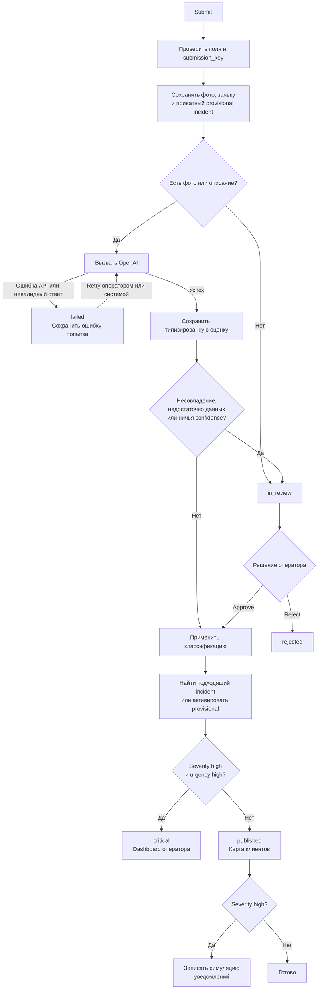
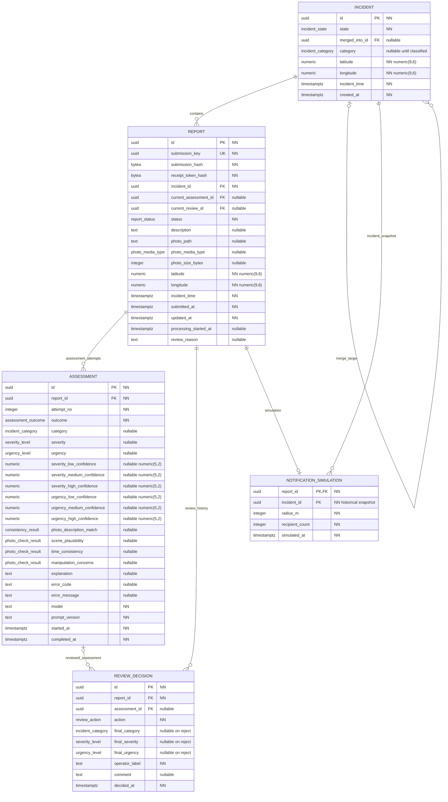

1. Сервисы и инфраструктура

Сервис	Ответственность
client-ui	Обслуживает клиентский React UI, проксирует запросы /api
operator-ui	Обслуживает отдельный React dashboard оператора, проксирует /api
api	Проверяет данные, сохраняет заявки, вызывает OpenAI, группирует инциденты, применяет решения оператора
db	Хранит заявки, инциденты, оценки и историю решений
OpenAI API	Возвращает оценку; правила маршрутизации выполняет FastAPI

Фотографии сохраняются в uploads, в базе находятся их пути и метаданные. Для оценки FastAPI отправляет содержимое фотографии в OpenAI; публичное файловое хранилище не требуется.
Оба UI используют общий API и одну базу. Dashboard для драфта обновляется опросом API каждые несколько секунд. Симуляция уведомлений — модуль FastAPI.
2. Структура UI
UI	Экран	Содержание и действия
Клиент	Отправка заявки	Фото из камеры/галереи, описание, обязательные место и время, Submit
Клиент	Карта	Опубликованные инциденты, маркеры, категория, число опубликованных заявок, карточка инцидента
Клиент	Статус заявки	Processing / review / результат / ошибка; оценка модели, confidence, итоговое действие
Оператор	Обзор	Счётчики processing, review, failed и critical; список инцидентов
Оператор	Review	Очередь заявок, исходные фото и описание, причины проверки, approve/reject, выбор категории и уровней
Оператор	Critical	Инциденты с критическими заявками, связанные заявки и оценки
Оператор	Детали инцидента	Все связанные заявки, исходные доказательства, оценки, решения и симуляции
Оператор	Ошибки обработки	Заявки с failed; повторная обработка существующей заявки

У оператора карты нет. После успешной отправки клиент видит заявку только для чтения: исправление, удаление и повторная обработка ему недоступны.
3. Обработка заявки

OpenAI оценивает данные. FastAPI проверяет ответ и самостоятельно применяет правила review, critical и публикации.
4. ERD
Обозначение NN означает NOT NULL. Типы numeric уточнены в комментариях.

current_assessment_id и current_review_id — дополнительные ссылки из REPORT на выбранные записи истории. Их ограничения перечислены ниже; на диаграмме основные связи истории показаны отдельно.
5. Назначение таблиц
Таблица	Что хранит	Правило изменения
REPORT	Исходную заявку и текущий статус обработки	Доказательства неизменяемы; backend обновляет статус и служебные ссылки
INCIDENT	Группу заявок, исходную точку и время для сравнения	Provisional активируется или объединяется; координаты и время якоря сохраняются
ASSESSMENT	Завершённые попытки обращения к модели, включая ошибки	Каждая попытка — новая запись; прошлые оценки не перезаписываются
REVIEW_DECISION	Решение оператора и полную итоговую классификацию	Новая запись истории; исходная оценка модели сохраняется
NOTIFICATION_SIMULATION	Факт симуляции, радиус и число условных получателей	Одна историческая запись на заявку

Отдельные таблицы пользователей, фотографий и получателей для этого драфта не нужны: аккаунтов нет, фотография у заявки одна, получатели симулируются.
6. ENUM
PostgreSQL ENUM	Значения
severity_level	low, medium, high
urgency_level	low, medium, high
report_status	processing, in_review, published, critical, rejected, failed
incident_state	provisional, active, merged
assessment_outcome	succeeded, failed
review_action	approve, reject
consistency_result	matches, mismatches, inconclusive, not_applicable
photo_check_result	no_obvious_concerns, suspicious, inconclusive, not_applicable
photo_media_type	image/jpeg, image/png, image/webp
incident_category	Для драфта: fire_smoke, road_hazard, infrastructure_damage, waste_pollution, other

Это PostgreSQL ENUM и соответствующие enum в моделях FastAPI. Confidence хранится числовыми колонками NUMERIC(5,2). Типы ENUM, числовые типы PostgreSQL.
7. Ограничения данных
Область	Ограничение
Координаты	Latitude от −90 до 90, longitude от −180 до 180
Время	incident_time обязательно; отдельно от времени отправки
Фото	Путь, media type и размер либо заполнены вместе, либо все NULL; размер положительный
Хеши	submission_hash и receipt_token_hash — SHA-256, по 32 байта
Идемпотентность	UNIQUE(submission_key)
Попытки оценки	attempt_no > 0, UNIQUE(report_id, attempt_no)
Confidence	Каждое заполненное значение от 0 до 100; каждая тройка заполнена целиком либо целиком NULL
Неопределённый уровень	NULL, без подстановки low или фиктивного нуля confidence
Ошибка оценки	Для outcome=failed обязательна ошибка; поля результатов оценки остаются NULL
Успешная оценка	Заполнены результаты применимости проверок и объяснение
Approve	Обязательны final_category, final_severity, final_urgency
Reject	Итоговые поля классификации остаются NULL
Активный incident	Категория обязательна
Merge	merged_into_id заполнен только для merged, ссылка на себя запрещена
Симуляция	radius_m > 0, recipient_count >= 0; PK по report_id исключает повтор

Сумму confidence не ограничиваем числом 100: PRD требует проценты уверенности по уровням, но не определяет их как нормированное распределение вероятностей. Каждый набор показывается по убыванию значения.
Для служебных ссылок нужны составные внешние ключи:
- (REPORT.id, current_assessment_id) → (ASSESSMENT.report_id, ASSESSMENT.id).
- (REPORT.id, current_review_id) → (REVIEW_DECISION.report_id, REVIEW_DECISION.id).
- (REVIEW_DECISION.report_id, assessment_id) → (ASSESSMENT.report_id, ASSESSMENT.id).
На целевых парах создаются UNIQUE. Это исключает выбор оценки или решения от чужой заявки.
8. Правила целостности в FastAPI
1. Сохранение заявки. В одной транзакции создаются приватный provisional incident и связанный report. Начальная связь циклична не будет: incident не содержит обратного FK на report.
2. Идемпотентность. Повтор запроса с тем же submission_key и тем же содержимым возвращает существующую заявку. Другой payload с тем же ключом возвращает конфликт. Клиент сохраняет ключ и случайный receipt token до отправки, чтобы восстановить результат при потерянном ответе.
3. Неизменяемость. Описание, фото, координаты и время происшествия после отправки не изменяются. На уровне БД это можно закрепить триггером. Статусы и служебные ссылки меняются backend.
4. Классификация. При approve используются итоговые поля текущего решения оператора. Без решения — текущая успешная оценка модели. Группировка, critical и уведомления используют одну и ту же итоговую классификацию. UI отдельно показывает модельные confidence и решение оператора.
5. Review. Без обоих видов доказательств, при несовпадении фото/описания или неопределённой классификации заявка остаётся приватной. Для равных максимумов confidence принимаем правило драфта: in_review.
6. Группировка. Сначала применяются категория и пределы расстояния/времени, затем выбирается минимальный weighted score. Для равных score — стабильный выбор по ID. Для небольшого демо обработку группировки сериализуем транзакционной блокировкой PostgreSQL; вызов OpenAI выполняется до этой транзакции.
7. Повторная обработка. Retry создаёт новую попытку оценки существующего report. Для уже финализированных published, critical и rejected повтор возвращает существующий результат. Переклассификацию опубликованных заявок в этот драфт не включаем.
8. Видимость. Карта показывает incident, если в нём есть published report. Critical report сам на карте не публикуется. Если он связан с уже опубликованным инцидентом, существующий маркер сохраняется; клиентские детали содержат опубликованные заявки.
9. Счётчики. Dashboard считает все связанные заявки, клиентская карта — опубликованные. Отдельная колонка report_count не хранится.
10. Симуляция. Создаётся один раз при первой подходящей публикации: severity high, urgency не high. Запись — исторический результат симуляции, без фактической отправки уведомлений.
9. API между UI и backend
Endpoint	Кто использует	Назначение
POST /api/reports	Клиент	Отправить заявку и получить ID/статус
GET /api/reports/{id}	Клиент с receipt token	Получить read-only результат своей заявки
GET /api/incidents	Клиент	Получить опубликованные маркеры
GET /api/incidents/{id}	Клиент	Получить публичную карточку инцидента
GET /api/operator/summary	Оператор	Счётчики dashboard
GET /api/operator/reports	Оператор	Заявки с фильтрами по статусу
GET /api/operator/reports/{id}	Оператор	Доказательства, попытки оценки и решения
GET /api/operator/incidents	Оператор	Инциденты, включая critical
GET /api/operator/incidents/{id}	Оператор	Все связанные заявки
POST /api/operator/reports/{id}/review	Оператор	Approve/reject
POST /api/operator/reports/{id}/retry	Оператор	Повтор обработки существующей заявки

Операторские операции проверяются backend отдельно. Таблица аккаунтов для этого не требуется: в контролируемом демо достаточно отдельного операторского доступа.
10. Индексы и настройки
Индексы:
- REPORT(incident_id, status).
- REPORT(status, submitted_at).
- INCIDENT(category, incident_time) WHERE state = 'active'.
- ASSESSMENT(report_id, attempt_no) — уникальный.
- REVIEW_DECISION(report_id, decided_at).
Предлагаемые начальные настройки FastAPI:
Настройка	Значение для демо
Максимальное расстояние совпадения	200 м
Максимальная разница времени	60 мин
Вес расстояния	1
Вес времени	5
Радиус симулированных уведомлений	1000 м

score = distance_meters × 1
      + absolute_time_difference_minutes × 5
Настройки остаются конфигурируемыми. Для небольшого числа демонстрационных инцидентов достаточно PostgreSQL и расчёта расстояния в FastAPI.